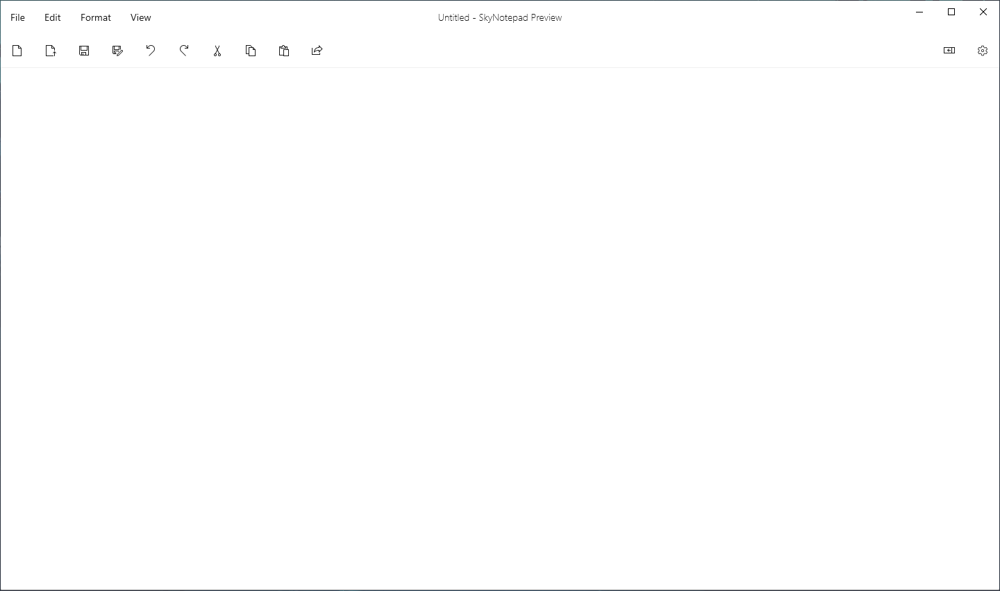
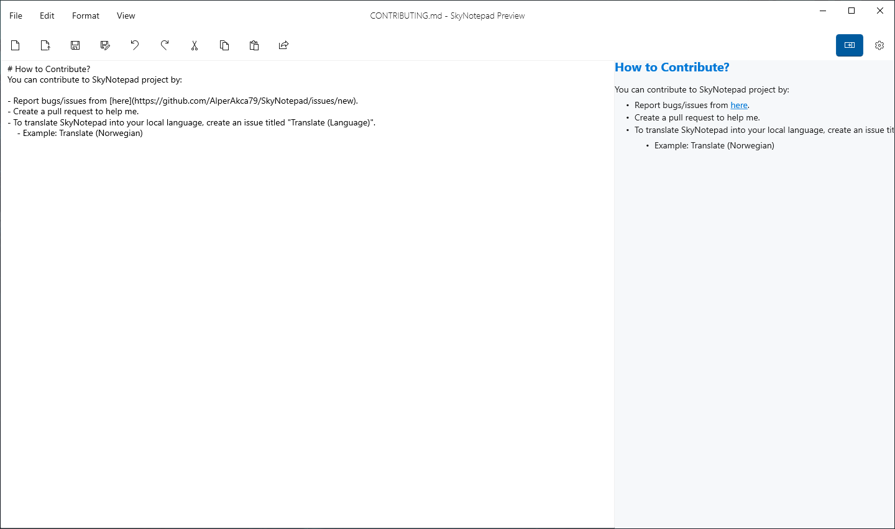
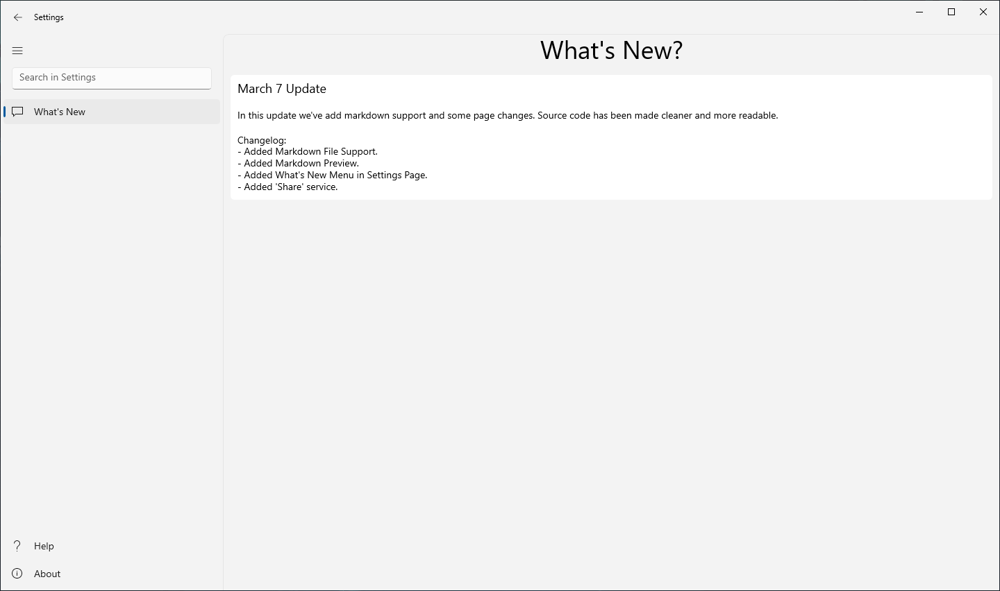
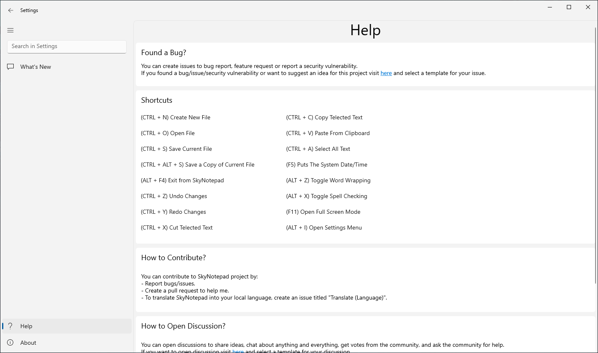
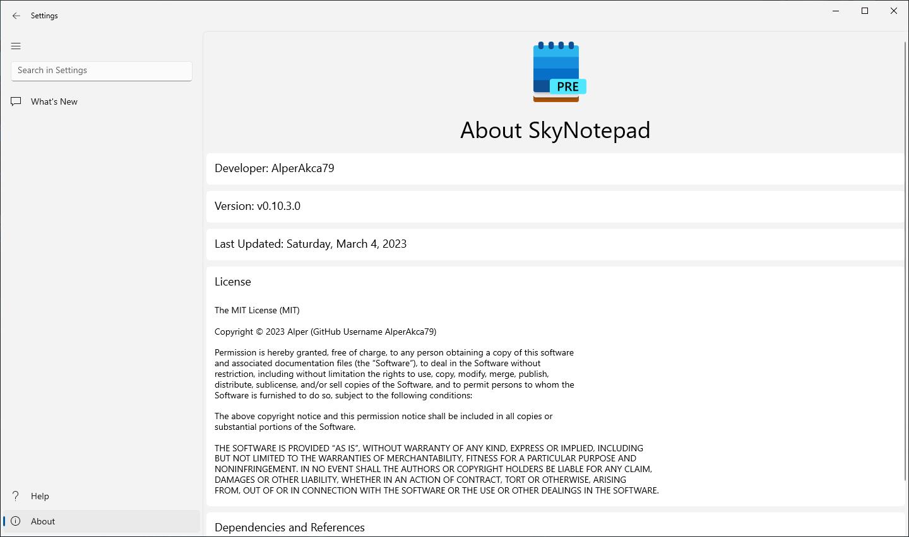
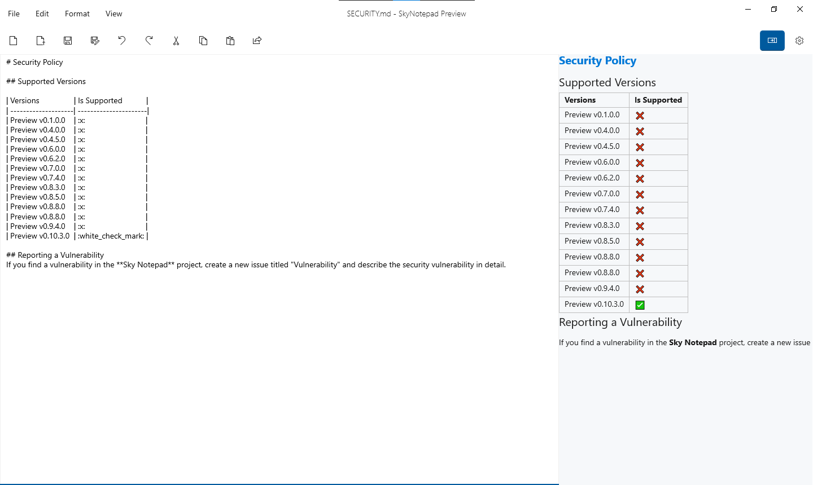
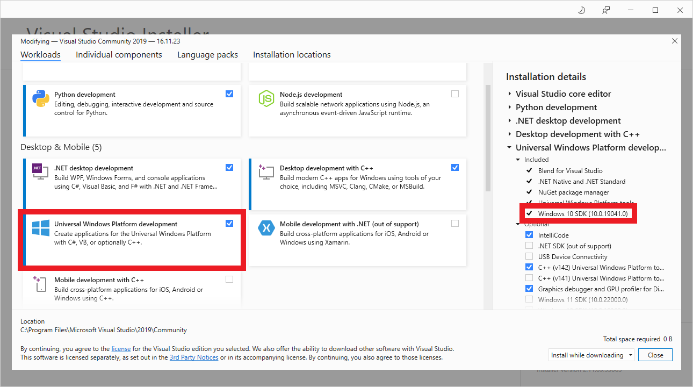

# SkyNotepad
<a href="https://github.com/AlperAkca79/SkyNotepad/">
    
</a>
<a href="https://github.com/AlperAkca79/SkyNotepad/releases/tag/0.10.3.0">
    
</a>
<a href="https://apps.microsoft.com/store/detail/skynotepad/9PN4B4WGKV6H">
    
</a>

# What is SkyNotepad?
SkyNotepad is Simple, Modern, Free and Open Source **Text Editor** for Windows. You Can Create/Edit Text Documents and Markdown Source Files. SkyNotepad has a Markdown Preview feature so you can organize your GitHub README files more easily. Sky Notepad is still in development and preview. If you see an bug please create a new issue from [here](https://github.com/AlperAkca79/SkyNotepad/issues/new/choose).

# About
- Developer: [AlperAkca79](https://github.com/AlperAkca79)
- Version: Preview v0.10.3.0
- First Build Date: Friday, February 10, 2023
- Last Update: Thursday, March 9, 2023 5:55 PM (UTC +03:00)
- License: [MIT License](https://github.com/AlperAkca79/SkyNotepad#License)
- Platform Architecture: x86, x64
- Supported OS(s): Windows 10/11
- Minimum Required OS Build: 17763.0 (1809)
- Supported Language: English (United States)

# Screenshots







# Features
- Word Wrapping
- Spell Checking
- Search in Web
    - Supported Search Engines
        - Microsoft Bing
        - Google
        - DuckDuckGo
        - Yandex
        - Yahoo
- Fluent Desing
- Lightweight
- Full Screen Mode
- Compact Overlay Mode (**New**)
- Markdown Source File Support
- Markdown Preview Support
- Sharing Service

# Shortcuts
- **(CTRL + N)** Create New File
- **(CTRL + O)** Open File
- **(CTRL + S)** Save
- **(CTRL + ALT + S)** Save As...
- **(ALT + F4)** Exit from Sky Notepad
- **(CTRL + Z)** Undo Changes
- **(CTRL + Y)** Redo Changes
- **(CTRL + X)** Cut
- **(CTRL + C)** Copy
- **(CTRL + V)** Paste
- **(CTRL + A)** Select All Text
- **(F5)** Puts Systems Date/Time
- **(ALT + Z)** Toggle Word Wrapping
- **(ALT + X)** Toggle Spell Checking
- **(F11)** Full Screen Mode
- **(ALT + S)** Open Settings

# Changelog

See the changelog for all versions [here](docs/changelog.md).

# How to Download?
You can download SkyNotepad in 3 ways:

### First Way (With [Windows Package Manager (aka winget)](https://github.com/microsoft/winget-cli)):

To download with winget, your operating system build number must be greater than 17763.0 (1809)

- Open Command Prompt (CMD) and type this:
```shell
winget install skynotepad
```

- Wait for the installation to complete.

- Done! You can use SkyNotepad now.

### Second Way (From [Microsoft Store](https://apps.microsoft.com))
Click [here](https://apps.microsoft.com/store/detail/skynotepad/9PN4B4WGKV6H) for download SkyNotepad from Microsoft Store.

### Third Way (From [GitHub](https://github.com))
- Download **.msixbundle** file from [here](https://github.com/AlperAkca79/SkyNotepad/releases/tag/0.10.3.0).
- Double click to **.msixbundle** file and install the **SkyNotepad**

NOTE **(Just for Preview v0.6.0.0)**: Download **Segoe.Fluent.Icons.ttf** file from [here](https://github.com/AlperAkca79/SkyNotepad/releases/download/0.6.0.0/Segoe.Fluent.Icons.ttf) for new _fluent_ icons. 

# Getting Started
Prerequisites:
- Your computer must be running Windows 10, build 19041.0 or newer.
- Install the Visual Studio 2019 or higher.
    - Install the "Universal Windows Platform Development" workload.
    - Install the Windows 10 SDK (10.0.19041.0).
    
- Open Command Prompt(CMD) and type this:
    ```shell
    git clone https://github.com/AlperAkca79/SkyNotepad.git
    ```
- Open [src/SkyNotepad.sln](https://github.com/AlperAkca79/SkyNotepad/blob/master/src/SkyNotepad.sln) in Visual Studio 2019 or higher to build and run the SkyNotepad application.

# Contributing
- See [here](https://github.com/AlperAkca79/SkyNotepad/blob/master/CONTRIBUTING.md) for How to Contribute?

# Dependencies and References
- [Windows UI Library (WinUI 2)](https://github.com/Microsoft/microsoft-ui-xaml) 

- [Segoe Fluent Icon (No Longer Available for Preview v0.6.2.0 and Above)](https://github.com/microsoft/fluentui-system-icons)
- [Windows Community Toolkit🧰](https://github.com/CommunityToolkit/WindowsCommunityToolkit)

# Security Policy
See [here](https://github.com/AlperAkca79/SkyNotepad/blob/master/SECURITY.md) for Version support and more.

# Code of Conduct
Click [here](CODE_OF_CONDUCT.md) for view Code of Conduct.

# License
Copyright © 2023 AlperAkca79

Sky Notepad is under licensed [MIT License](https://mit-license.org). See [here](LICENSE.md) for more information.