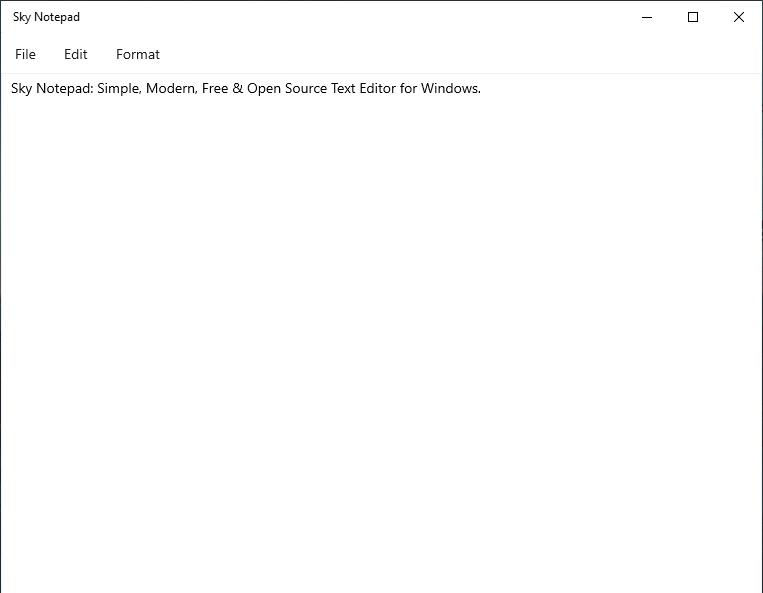
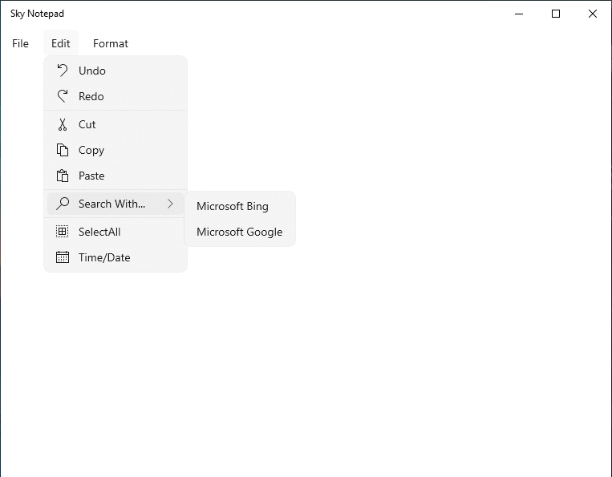
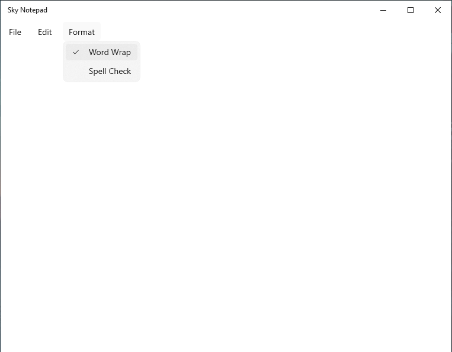

# Sky Notepad
<p align="center">
    
</p>

# What is Sky Notepad?
Sky Notepad is Simple, Modern, Free and Open Source **Text Editor** for Windows.

NOTE: Sky Notepad is still in development and preview. If you see an bug please create a new issue from [here](https://github.com/AlperAkca79/SkyNotepad/issues/new).

# About
- Version: Preview v0.4.0.0
- First Build Date: Friday, February 10, 2023
- Last Update: Friday, February 17, 2023
- License: [MIT License](https://github.com/AlperAkca79/SkyNotepad#License)
- Platform Architecture: x86, x64
- Supported OS: Windows 10/11
- Required OS Build: 17763.0 (1809)
- Supported Language: English (United States)

# Screenshots






# Features
- Word Wrapping
- Spell Checking
- Search in Web

# How to Download?
- Download **.cer** and **.msixbundle** files from [here](https://github.com/AlperAkca79/SkyNotepad/releases/tag/0.4.5.0).
- Double click to open **.cer** file.
- Click **"Install Certificate..."**.
- Select **"Local Machine"** and click **"Next"**.
- Click **"Yes"** from the Admin permission screen.
- Select **"Place all certificates in the following store"** and click **"Browse"**.
- Select **"Trusted Root Certification Authorities"** and click **"OK"**.
- Click **"Next"** and after click **"Finish"**.
- Click **"OK"**.
- Finally double click to **.msixbundle** file and install the **Sky Notepad**

# Getting Started
Prerequisites:
- Your computer must be running Windows 10, build 19041.0 or newer.
- Install the Visual Studio 2019 or higher.
    - Install the "Universal Windows Platform Development" workload.
    - Install the Windows 10 SDK (10.0.19041.0).
    
- Open Command Prompt(CMD) and type this:
    ```shell
    git clone https://github.com/AlperAkca79/SkyNotepad.git
    ```
- Open [src/SkyNotepad.sln](https://github.com/AlperAkca79/SkyNotepad/blob/master/src/SkyNotepad.sln) in Visual Studio 2019 or higher to build and run the SkyNotepad application.

# Contributing
- [How to Contribute?](https://github.com/AlperAkca79/SkyNotepad/blob/master/CONTRIBUTING.MD)

# Dependencies and References
- [Windows UI Library (WinUI 2)](https://github.com/Microsoft/microsoft-ui-xaml)

# Code of Conduct
Click [here](CODE_OF_CONDUCT.md) for view Code of Conduct.

# License
Sky Notepad is under licensed [MIT License](https://mit-license.org).